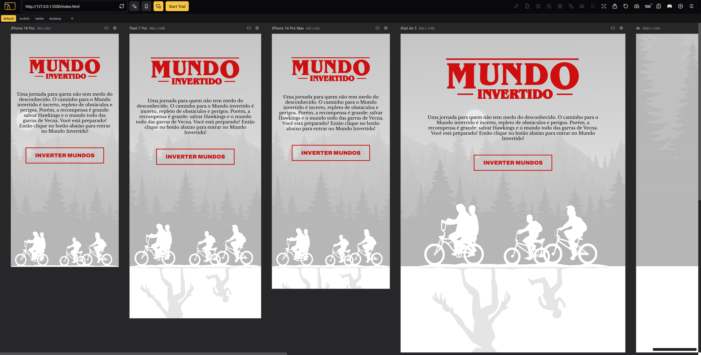
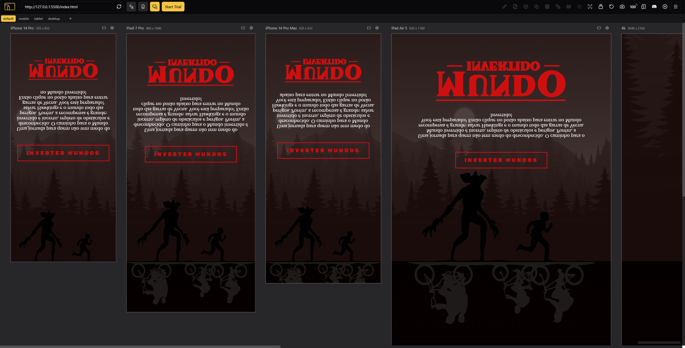
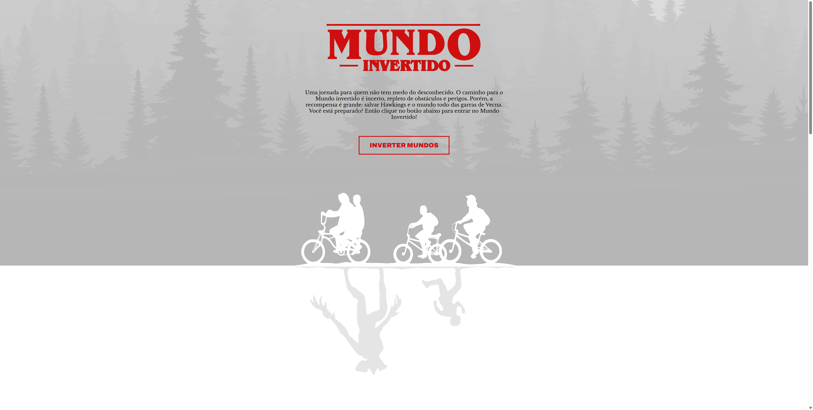
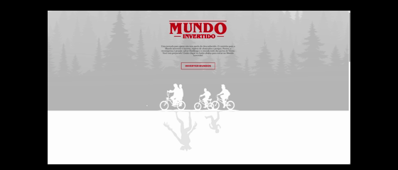
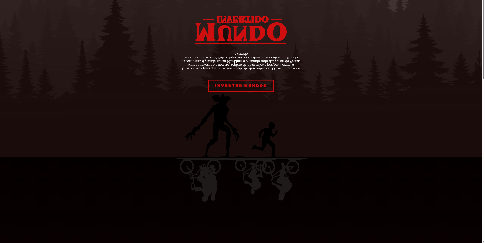
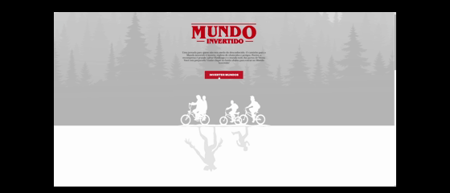

<p align="center">
    
</p>

-------
Bem-vindo ao Mundo Invertido, um projeto desenvolvido durante a Semana Frontend da DIO, onde foi recriado uma landing page interativa inspirada no universo de Stranger Things.

O objetivo foi praticar conceitos essenciais de HTML, CSS e JavaScript, além de explorar animações, temas dinâmicos e manipulação de DOM.


## 💻 Tecnologias
- HTML
- CSS
- JavaScript

## 📸 Prévia
### Versão para **Mobile** e **Tablet**



### Versão para **Desktop**





## 💬 Assuntos abordados
- HTML
    - Estruturação da página 
    - Semântica
    - Acessibilidade
    - Web Scraping
    - SEO
- CSS
    - Posicionamentos
    - Pseudo-elementos
    - Pseudo-classes
    - Flexbox
    - Animações 
- JavaScript
    - Introdução ao JavaScript
    - Manipulação do DOM
    - Introdução ao Firebase
    - Integração com o Firebase

## 🎨 Variáveis do Tema CSS
```css
/*** VARIABLES & THEMES ***/

:root {
  --primary-color: #cf0f0f;
  --primary-color-contrast: #ffffff;
  --field-background-color: #000;
}

.light-theme {
  --page-background: linear-gradient(
    180deg,
    #ffffff 0%,
    #ffffff 65%,
    rgba(255, 255, 255, 0.75) 100%
  );
  --header-background-color: #e3e3e3;
  --highlight-color: #000000;
  --featured-font-family: "Archivo", sans-serif;
  --character-top-image-src: url("../images/characters/kids-on-the-bike.svg");
  --character-top-image-color: #ffffff;
  --character-bottom-image-src: url("../images/characters/inverted-world-monster.svg");
  --character-bottom-image-color: #e5e5e5;
  --background-lamp-image: url("../images/backgrounds/lamps.png");
  --footer-background-color: #b5bbbf;
}

.dark-theme {
  --page-background: linear-gradient(
    180deg,
    #050000 0%,
    #130404 65%,
    rgba(19, 1, 1, 0.75) 100%
  );
  --header-background-color: #220f0f;
  --highlight-color: #ffffff;
  --featured-font-family: "Rubik Glitch", sans-serif;
  --character-bottom-image-src: url("../images/characters/kids-on-the-bike.svg");
  --character-bottom-image-color: rgba(255, 255, 255, 0.1);
  --character-top-image-src: url("../images/characters/inverted-world-monster.svg");
  --character-top-image-color: #000;
  --background-lamp-image: url("../images/backgrounds/lamps-inverted.png");
  --footer-background-color: #000;
}
```
## 📱 Alterações feitas por mim [victorrf](https://github.com/victorrf/):

- Criação da pasta "script" e o arquivo "main.js" e colocado o script que estava no html dentro dele;
- CSS criação de 3 arquivos, "reset" aonde está os estilos genericos e as fontes;
- "main" aonde encontra todos o restante do CSS original;
- E o "responsive" aonde coloquei a responsividade que ajeitei do projeto.
- Firebase configurado, env.js dentro do gitignore para não vazar a apiKey do Banco de dados.


## ▶️ Execute o projeto
### 👉 https://victorrf.github.io/semana-frontend-mundo-invertido/

## 📄 Licença

Este projeto é apenas para fins educacionais e não possui licença oficial.